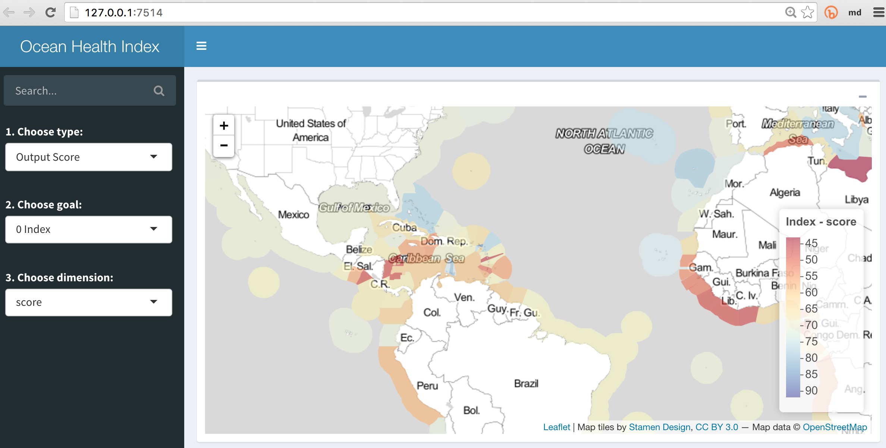

# ohi-shiny2

simple OHI Shiny app, round 2

Since attending [#shinydevcon](https://www.rstudio.com/shinydevcon/), couldn't help applying newfound knowledge towards updating OHI Shiny app, particularly for [ohi-global](http://ohi-science.nceas.ucsb.edu/ohi-global/) and in anticipation of porting Herman's htmlwidget of [ohi-aster](https://github.com/FrissAnalytics/ohi-aster).

See the [live **demo**: ](https://bdbest.shinyapps.io/ohi-shiny2/).

You can also try this out by running the following in [R](https://cran.r-project.org/) or [RStudio](https://www.rstudio.com/products/rstudio/download/):

```r
# install.packages('shiny')
shiny::runUrl('bbest/ohi-shiny2', subdir='app')
```

This implementation uses:

- [shinydashboard](http://rstudio.github.io/shinydashboard/)
- [leaflet](http://rstudio.github.io/leaflet/)

The high resolution global EEZ shapefile was greatly simplified with the excellent [`rmapshaper::ms_simplify`](https://github.com/ateucher/rmapshaper#usage). See [prep_rgns.Rmd](prep_rgns.Rmd) for specifics.

Improvements are noted throughout the `ui.R`, `server.R` and `global.R` code files with many `TODO:` statements.

